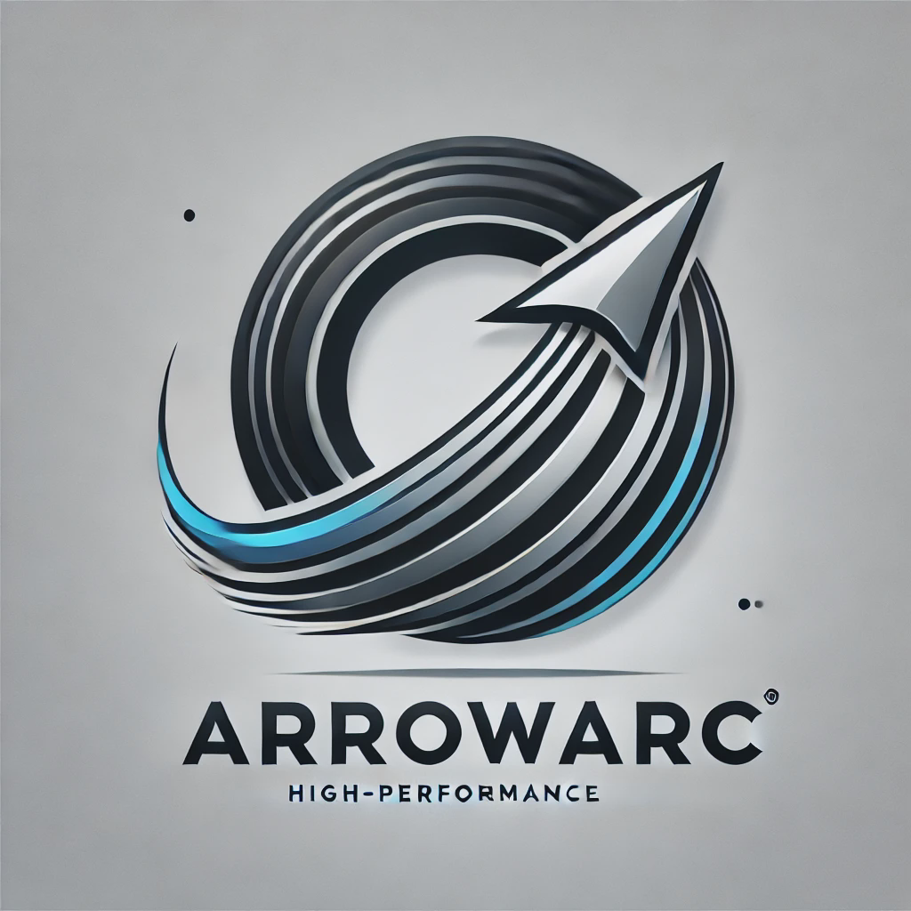

**ArrowArc** is a high-performance data integration platform designed to challenge the status quo in big data processing. At its core, ArrowArc is built on the principle that **"small data is the new big data"**—a recognition that for the vast majority of use cases, traditional Big Data tools, including modern data warehouses like Snowflake or BigQuery, are not always necessary.

ArrowArc provides an alternative approach to data exchange between platforms and systems, focusing on speed, efficiency, and optimal resource utilization. This platform acknowledges that "small data" is not strictly about volume but about intelligently leveraging data processing tools that are better suited for many real-world applications.

Leveraging the power of :bow_and_arrow: **Apache Arrow**, Go, and other cutting-edge technologies, ArrowArc enables rapid data movement between various sources and sinks. The platform is designed with a singular focus on breakneck speed and simplification of complex data workflows, abstracting away the intricacies of modern data integration while leveraging the capabilities of modern hardware.

By shifting the focus from merely handling large-scale data to optimizing the performance of smaller, more targeted datasets, ArrowArc makes pseudo-realtime data integration both feasible and cost-effective. This allows organizations to sync data at frequent intervals—every hour, 10 minutes, or whatever their needs dictate—without the prohibitive costs associated with true streaming solutions like Dataflow at scale.

Whether you're dealing with cloud storage, relational databases, or diverse file formats, ArrowArc offers a streamlined, high-performance solution that prioritizes efficiency and ease of use. This makes it the ideal platform for modern data integration challenges, especially for those looking to embrace the small data revolution.

---

## Overview

ArrowArc is architected to handle complex data integration tasks with a focus on extreme performance, low latency, and high throughput. At the heart of ArrowArc's design is a commitment to efficient, concurrent data processing—an area where Go excels due to its built-in support for concurrency and its lightweight goroutines.

### Go Channels for Data Streaming

The core of ArrowArc is built around a common pattern for data extraction and ingestion, utilizing Go channels as the interface for streaming data between various sources and sinks:

```go
<-chan arrow.Record, <-chan error
```

### Why Go Channels?

Go channels are a powerful concurrency primitive that enable safe and efficient communication between goroutines. In the context of ArrowArc, channels provide a natural and elegant way to stream data (in the form of Apache Arrow `Record` objects) between different components of the system.

- **Concurrency and Parallelism**: Go's concurrency model allows multiple tasks to run concurrently, facilitating efficient parallel data processing. By using channels, ArrowArc can seamlessly manage data flow between producer and consumer goroutines, ensuring that data is processed as quickly as it becomes available.

- **Decoupling Data Flow**: Channels decouple the production and consumption of data. Producers (such as data extraction routines) can send data to a channel as soon as it's ready, without needing to wait for consumers (such as data ingestion routines) to be available. This decoupling enhances resource utilization and throughput, allowing both sides to operate independently.

- **Error Handling**: By returning a second channel specifically for errors (`<-chan error`), ArrowArc ensures clean and structured error handling. This approach allows any issues during data processing to be communicated back to the caller without interrupting the data flow.

- **Low Latency and High Throughput**: Go channels, in combination with goroutines, minimize the overhead associated with data transfer between system components. This leads to lower latency in data processing and higher overall throughput, enabling continuous and efficient data streaming.

### Why This Interface?

The interface `<-chan arrow.Record, <-chan error` was chosen for several key reasons:

- **Simplicity**: This interface is straightforward and intuitive, making it easy for developers to work with. The dual-channel pattern clearly separates data from error handling, reducing complexity within the codebase.

- **Flexibility**: The use of channels provides flexibility in data processing. Components can be composed in various ways, allowing for easy integration with different data sources, sinks, and processing pipelines.

- **Scalability**: This pattern naturally scales with the number of goroutines and channels, enabling ArrowArc to handle large volumes of data without becoming a bottleneck. Whether dealing with small datasets or large-scale data integration tasks, this approach ensures consistent performance.

- **Alignment with Go’s Strengths**: Go excels at managing concurrent workloads efficiently. By leveraging channels as the primary interface for data exchange, ArrowArc fully embraces Go’s concurrency model, ensuring that the platform can meet the demands of modern data processing with minimal overhead.

## Intent of the Architecture

The architecture of ArrowArc is designed to expose a flexible and efficient pattern for both data extraction and ingestion, where all integrations (sources and sinks) follow a common interface using channels to stream Apache Arrow records. This approach ensures that data flows through the system with minimal overhead, maintaining the high-speed processing capabilities of Apache Arrow while leveraging the concurrency features of Go.

By adhering to this common pattern, ArrowArc demonstrates how different components can be integrated into a cohesive system, making it easier to extend and adapt to new data formats and storage solutions.

---

### Key Features

- **Common Extraction and Ingestion Pattern**: All integrations leverage a standardized approach using a common interface for both input and output, simplifying the development and extension of connectors and sinks.
- **Streaming Data Integration**: Efficiently stream data between sources and sinks with minimal overhead.
- **Support for Multiple Formats**: Write data to Parquet, CSV, and more, directly to destinations like Google Cloud Storage (GCS).
- **Go-Based Architecture**: Built entirely in Go, ArrowArc maximizes performance, scalability, and concurrency management.
- **Apache Arrow Integration**: Utilizing Apache Arrow for in-memory columnar data processing, ArrowArc ensures high-speed data handling and interoperability between systems.
- **Extensible and Modular Design**: Easily extend ArrowArc to support additional data formats or cloud storage providers by following the established patterns.

## Components

### Integrations

ArrowArc is engineered with a singular focus: achieving breakneck speed and simplifying data integration workflows centered around Apache Arrow. By abstracting away much of the inherent complexity, ArrowArc enables developers to integrate with various platforms, storage providers, and data formats, both for extraction and ingestion purposes.

#### Example: Google Cloud BigQuery

```go
func (bq *BigQueryConnector) GetBigQueryArrowStream(ctx context.Context, projectID string, datasetID string, tableID string, format string) (<-chan arrow.Record, <-chan error) {
}
```

### Sinks

Data can be streamed and written to various sinks, such as Google Cloud Storage and Postgres. ArrowArc supports writing data in formats like Parquet and CSV or platforms like DuckDB, with more integrations coming.

#### Example: Google Cloud Storage

```go
func (s *GCSSink) WriteGCSArrowStream(ctx context.Context, records <-chan arrow.Record, filePath string, format FileFormat, delimiter ...rune) <-chan error {
}
```

---

### Gluing it All Together

ArrowArc simplifies high-performance data synchronization, enabling tasks like rewriting a Parquet file with minimal code.

```go
// Stream data from a Parquet file
recordChan, errChan := GetParquetArrowStream(ctx, inFilePath, false, 1000000)

// Handle errors
go func() {
    if err := <-errChan; err != nil {
        log.Fatalf("Error streaming from Parquet file: %v", err)
    }
}()

// Write data to an output Parquet file
if err := WriteFileParquet(ctx, outputFilePath, recordChan); err != nil {
    log.Fatalf("Error writing to output Parquet file: %v", err)
}
```

In just a few lines of code, ArrowArc can stream data from a Parquet file and write it back out, all while leveraging the power of Apache Arrow for in-memory data processing. This streamlined approach allows you to focus on building effective solutions without getting entangled in the complexities of data handling.

Additionally, ArrowArc makes it easy to read data once from a source and write it to multiple sinks efficiently.

```go
recordChan, errChan := GetBigQueryArrowStream(ctx)

var wg sync.WaitGroup

// Setup multiple sinks
sinks := []string{"GCS[parquet]", "File[avro]", "Postgres"}
for _, sink := range sinks {
    wg.Add(1)
    go WriteToSink(ctx, sink, recordChan, &wg)
}

// Error handling goroutine
go func() {
    for err := range errChan {
        if err != nil {
            log.Printf("Error occurred: %v", err)
            cancel() // Cancel all operations if an error occurs
        }
    }
}()

wg.Wait() // Wait for all sinks to finish processing
```

---

### Arrow Flight Note

Apache Arrow Flight is a groundbreaking initiative that introduces a high-performance wire protocol designed for large-scale data transfers. It leverages the Apache Arrow in-memory columnar format to enable faster and more efficient data exchange between systems, particularly in the context of modern, distributed data environments. Arrow Flight's ability to reduce serialization and deserialization overhead makes it a compelling choice for real-time data operations and integration.

ArrowArc fully recognizes the potential of Arrow Flight and will support it as part of its broader data exchange capabilities. However, it’s important to note that Arrow Flight defines a wire protocol that needs to be implemented by database vendors. While Apache Arrow itself has firmly established its place in the data processing ecosystem, the adoption and longevity of Arrow Flight remain uncertain. The success of Arrow Flight largely depends on its adoption by database vendors and the broader data community.

This uncertainty was a key motivator behind the creation of ArrowArc. ArrowArc seeks to provide a flexible and efficient data exchange platform that does not rely solely on the adoption of a specific protocol like Arrow Flight. Instead, ArrowArc focuses on speed, efficiency, and broad compatibility with existing systems, while embracing the full potential of the Apache Arrow ecosystem as it relates to data exchange. This approach ensures that organizations can optimize their data integration processes today, while remaining adaptable to future developments in the Arrow ecosystem.

In essence, while ArrowArc will support Arrow Flight and embrace its potential, it also provides a more immediate and adaptable solution for data integration challenges, ensuring that organizations can achieve high performance and efficiency without being dependent on the future adoption of any one technology.

---

## :page_facing_up: License

ArrowArc is bestowed upon the realm under the MIT License. Refer to the [LICENSE](./LICENSE) scroll for more details.

## :bow_and_arrow: Author

Thomas F McGeehan V (<https://github.com/TFMV>)
